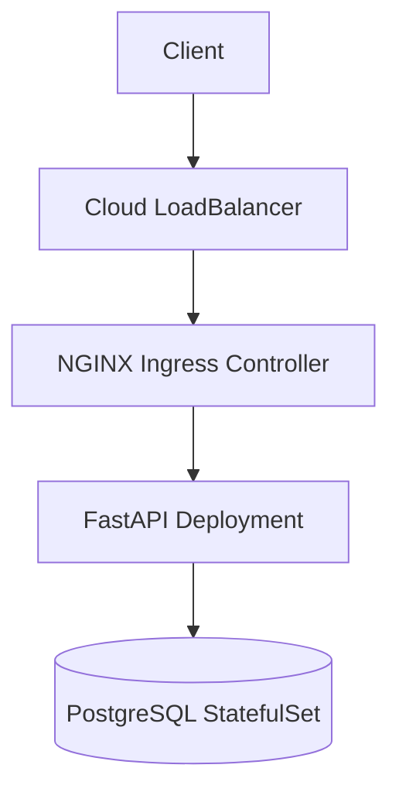
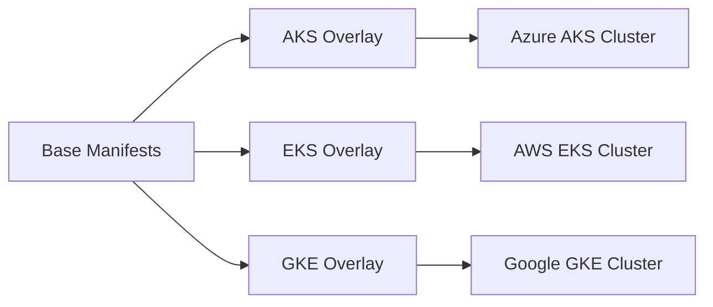

#Kube Portable FastAPI

Multi-cloud Kubernetes deployment of a FastAPI app with PostgreSQL.

##Deployed to:

Azure AKS

AWS EKS

Google GKE




##Stack

Python

FastAPI

PostgreSQL 16

Docker

Kubernetes

Kustomize

NGINX Ingress

GitHub Actions

##Deploy

AKS:

```kubectl apply -k k8s/overlays/aks```

EKS:

```kubectl apply -k k8s/overlays/eks```

GKE:

```kubectl apply -k k8s/overlays/gke```

Health check:

```curl -H "Host: api.localtest.me" http://<EXTERNAL-IP>/healthz```

Expected:

```{"ok":true}```

##What This Project Demonstrates

Multi-cloud Kubernetes portability

Stateful workloads with persistent storage

Ingress + LoadBalancer networking

Readiness and liveness probes

CI validation of Kustomize overlays
